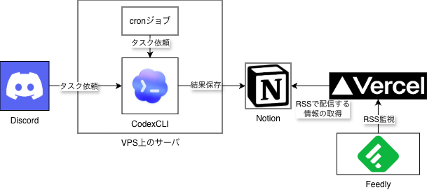

## 作ったもの

Discrodやローカルから要約やDeep DiveをCodex CLIにタスクとして依頼する仕組みを作りました。
調査結果はNotionに保存し、RSSで配信するようにしています。
アーキテクチャは以下のような形です。

## なぜこれを作ったのか？

そもそもなぜこれを作ったのか？というと、VPS上のサーバで収集しているTelegramチャットの要約をしたかったからです。
実は既に似たような仕組みは既に構築済みでした。
直近24時間のTelegramチャットを取得し、OpenAIのAPIを利用して要約、要約結果をDiscordに送信していました。
しかし、Telegramチャットの数や要約の実行頻度が増えるとDiscordの通知が増え見づらくなった & APIの課金料金も増えていきました。
そこで、既存の機能を踏襲しつつ、使いながら改修しているうちに出来上がったものが上記の構成です。

## 要件

- VPSのサーバやCodexのサブスクリプション以外は無料サービスにしたい

- Discordのチャットを要約し、Discordに通知するBotをVPS上のサーバで動かしていたが、API課金が発生していた

- Feedlyを使って情報収集しており、情報を一元管理できるようにしたかった

- 要約や調査結果を後から見返したい

## おわりに

